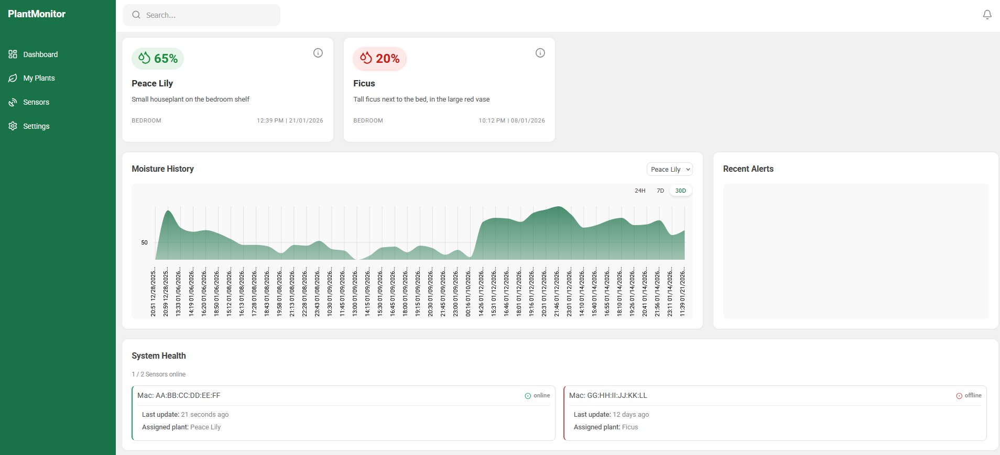

# Plant Monitor IoT - Soil Moisture Tracking System

  [](#) [](#) [](#)

A full-stack IoT solution designed to monitor the soil moisture levels of household plants. The system collects real-time data from sensors, processes it through a ASP .NET Core backend, and shows it on an Angular frontend, ensuring no plant is ever over-watered or neglected.


## Overview

This application serves as the center for a network of soil moisture sensors. The system is deployed on a local Proxmox home server via Docker, and is designed to handle data streams from multiple ESP32 devices. It features historical data graphing, device management, and a PostgreSQL database.

Architecture: Microservices - Frontend, Backend, Database - orchestrated via Docker Compose.

## Features

### Device & Data Management
- **Sensor Integration**: Ingests real-time moisture data from IoT devices via API
- **Device Health Checks**: Monitors sensor connectivity and status
- **Historical Logging**: Persists sensor readings in PostgreSQL

### Dashboard & UI
- **Real-Time Visualization**: Dynamic charts displaying moisture trends over time
- **Plant Management**: CRUD interface for managing plant profiles (Name, Description, Group)
- **Responsive Design**: Optimized for viewing on desktop or mobile

### Infrastructure
- **Containerized Deployment**: Isolated services using Docker
- **Reverse Proxy**: Nginx routing for API and frontend integration

### Custom 3D printed case
- ***Custom CAD Design***: specifically made to compactly house the LM393 and ESP-32
- **Magnetic Mounting** convenient magnetic attachment to the clip for easy mounting on vases
- **Print-Ready** design requires minimal supports for easy 3D printing


## Technologies used

**Frontend:** Angular <br>
[](#)

**Backend:** ASP .NET Core, Entity Framework <br>
[](#)

**Database:** PostgreSQL <br>
[](#)


**DevOps & Infrastructure:** Docker, Portainer, ProxMox  <br>
[](#)
[](#)


## Deployment
The application is deployed on my local Proxmox Virtual Machine using Docker Compose. Updates are managed via Portainer.

## Project Structure
```
plant-monitor-iot/
│
├── docker-compose.yml # Orchestration config
├── init.sql # DB creation script
│
├── backend/
│ ├── Dockerfile
│ ├── Controllers/ # API endpoints 
│ ├── Models/ 
│ ├── DTOs/ # EF Core context
│ └── Program.cs
│
├── frontend/
│   ├── Dockerfile
│   ├── nginx.conf       # Reverse proxy config
│   ├── angular.json
│   ├── package.json
│   ├── public/
│   └── src/
│       ├── app/
│       │   ├── components/  # Reusable UI components
│       │   ├── models/      # TypeScript interfaces
│       │   ├── pages/       # Main route views
│       │   ├── services/    # API logic
│       │   ├── app.config.ts
│       │   ├── app.routes.ts
│       │   └── main-layout.component.ts
│       ├── environments/
│       ├── index.html
│       ├── main.ts
│       └── styles.scss
│
└── postgres-data/ # Persisted DB volume (GitIgnored)
```

Structure ensures separation of concerns. The docker-compose.yml links the independent services. Postgres-data folder mounted to ensure data survives container restarts.

## Notes
Status: The project is live on the local server. Setup requires Docker and Docker Compose installed on the host machine. init.sql automatically populates the database on the first run.

## Dashboard UI


