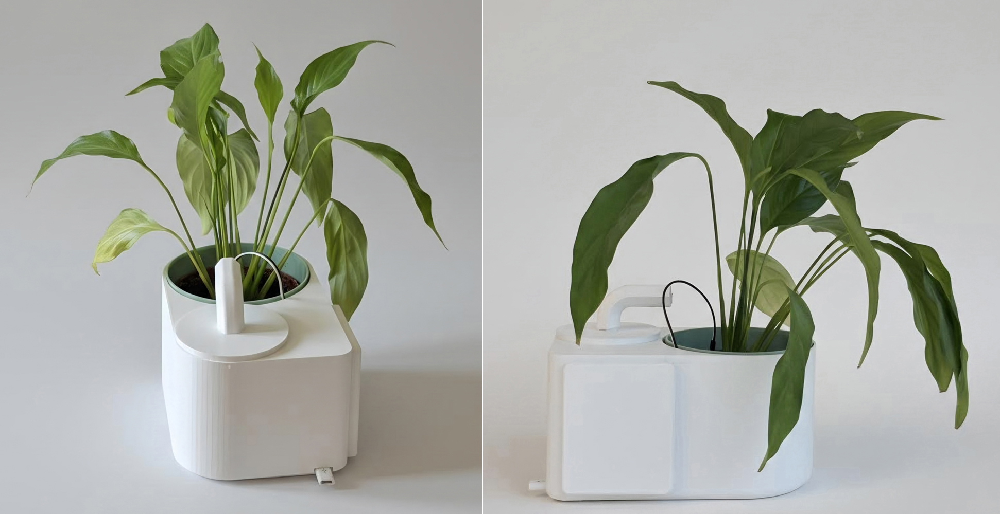
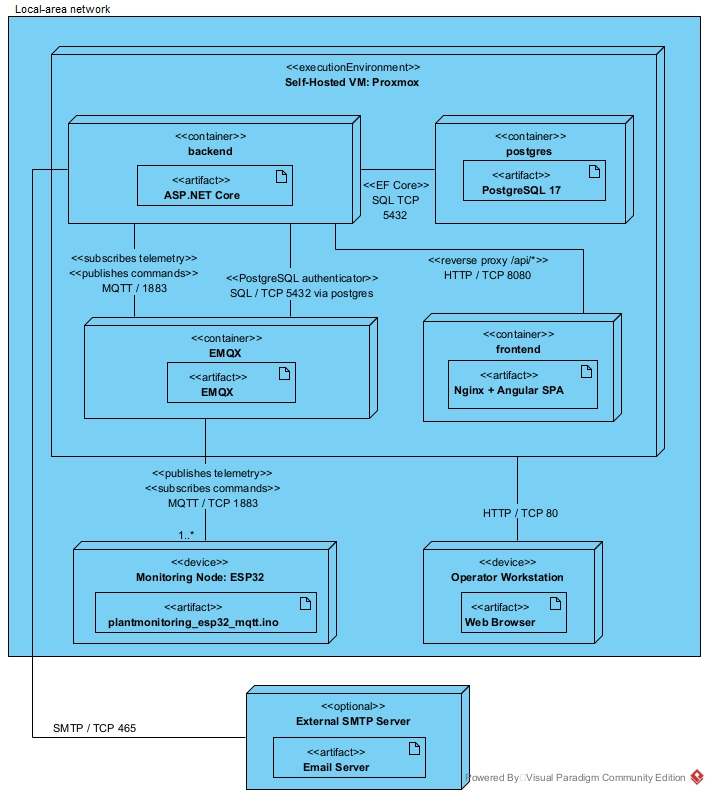
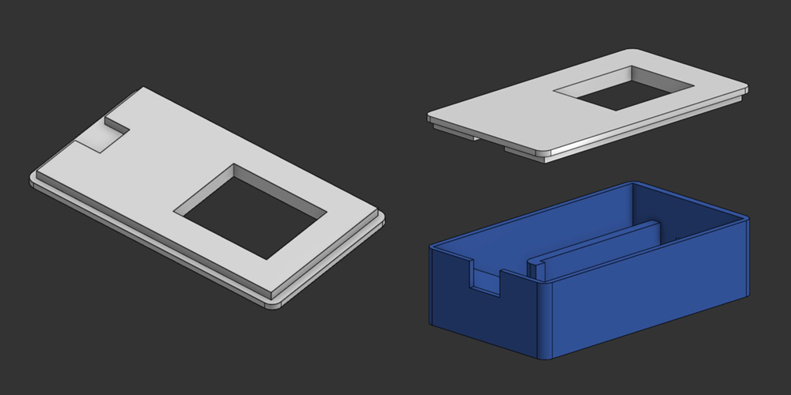
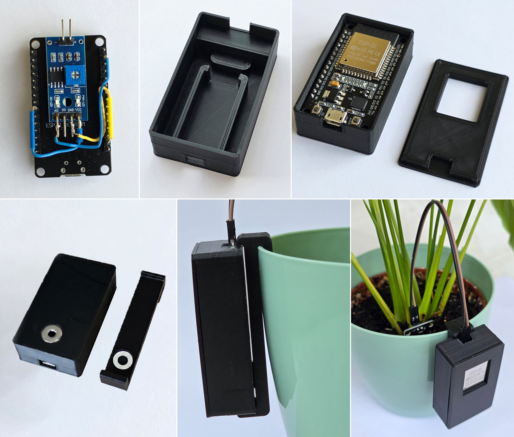
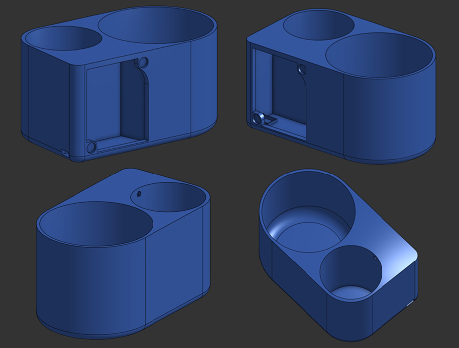
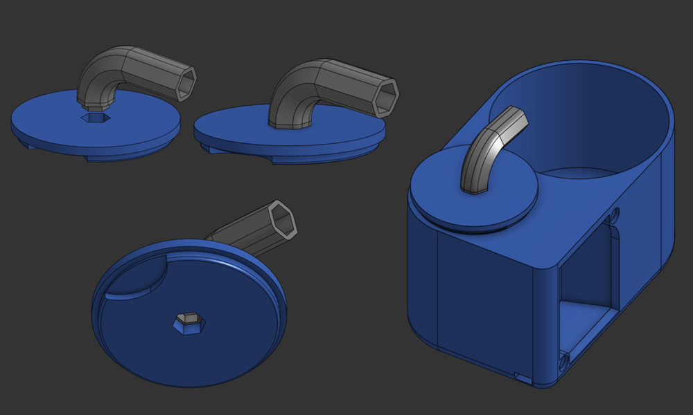
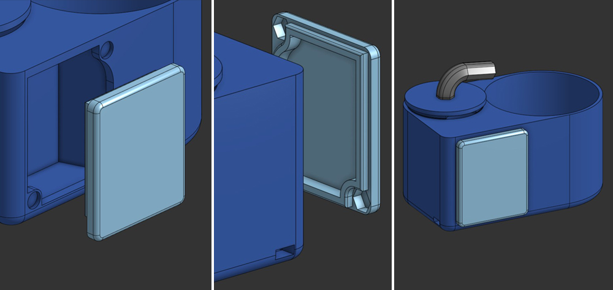
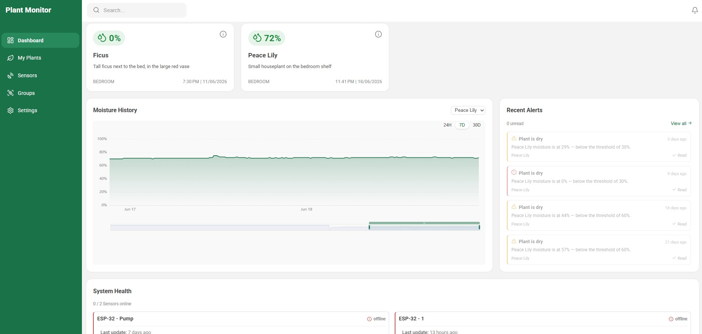

# Plant Monitor IoT - Soil Moisture Tracking System

[](https://github.com/BerinS/plant-monitor-iot/actions/workflows/ci-cd.yml)

  [](#) [](#) [](#) [](#)

A full-stack IoT solution designed to monitor the soil moisture levels of household plants and water them when needed. ESP32 sensor nodes send readings over MQTT, an ASP.NET Core backend processes and stores them, and an Angular dashboard shows everything in one place, ensuring no plant is ever over-watered or neglected.




## Overview

This application serves as the center for a network of ESP32 soil moisture sensors. Each node takes a reading every 15 minutes and publishes it to an EMQX MQTT broker, and the backend listens for those messages, saves them to PostgreSQL and checks them against each plant's moisture threshold. The same MQTT connection is used the other way around to send watering commands to a pump on the node.

The system runs on a local Proxmox home server as four Docker containers (frontend, backend, database, MQTT broker) orchestrated with Docker Compose, and is deployed automatically through a CI/CD pipeline.

## Features

### Device & Data Management
- **MQTT Sensor Integration**: ESP32 nodes publish moisture readings to `devices/{id}/telemetry`
- **Device Health Checks**: Monitors sensor connectivity and last-seen status
- **Historical Logging**: Persists sensor readings in PostgreSQL

### Watering & Alerts
- **Remote Watering**: Trigger the pump from the dashboard, sent to the node as an MQTT command (with an 8 second hard limit on the device)
- **Moisture Thresholds**: Each plant has its own threshold, dropping below it creates a notification
- **Email Notifications**: Optional email alerts via SMTP, configured from the Settings page
- **Event Log**: Keeps a history of watering events and who triggered them

### Dashboard & UI
- **Real-Time Visualization**: Dynamic charts displaying moisture trends over time
- **Plant Management**: CRUD interface for managing plant profiles (Name, Description, Group, Threshold)
- **Groups**: Organise plants by room or location
- **Responsive Design**: Optimized for viewing on desktop or mobile

### Infrastructure
- **Containerized Deployment**: Isolated services using Docker
- **Reverse Proxy**: Nginx routing for API and frontend integration
- **CI/CD**: Every push to `main` is tested, built and deployed automatically (see [Deployment](#deployment))



### Custom 3D printed enclosures
- ***Custom CAD Design***: specifically made to compactly house the LM393 sensor module, ESP32 and relay
- **Magnetic Mounting**: convenient magnetic attachment to the clip for easy mounting on vases
- **Print-Ready**: designs require minimal supports for easy 3D printing

### Base Monitoring Node





### Automatic Watering Vase








## Technologies used

**Frontend:** Angular <br>
[](#)

**Backend:** ASP .NET Core, Entity Framework, MQTTnet <br>
[](#)

**Database:** PostgreSQL <br>
[](#)

**Messaging:** EMQX (MQTT broker) <br>
[](#)

**Hardware:** ESP32, LM393 soil moisture sensor, relay + water pump <br>
[](#)

**Infrastructure:** Docker, GitHub Actions, Cloudflare Tunnel, Proxmox  <br>
[](#)
[](#)
[](#)


## Deployment
The application runs on a Proxmox virtual machine using Docker Compose. Deployments are automated with GitHub Actions:

1. **Test**: every pull request and push runs the backend integration tests and a production build of the frontend
2. **Build**: on `main`, Docker images for the backend and frontend are built and pushed to GitHub Container Registry, tagged with the commit SHA
3. **Deploy**: the workflow connects to the VM over SSH through a Cloudflare Tunnel (protected by Cloudflare Access), and runs `scripts/deploy.sh`, which pulls the new images, restarts the containers and waits for a health check

No ports are opened on the home network, and the deploy SSH key can only run the deploy script. Older versions can be redeployed from the Actions tab for a quick rollback.

## Project Structure
```
plant-monitor-iot/
│
├── .github/workflows/     # CI/CD pipeline (test, build, deploy)
├── docker-compose.yml     # Orchestration config
├── .env.example           # Template for the required environment variables
├── scripts/deploy.sh      # Runs on the VM, pulls and restarts containers
│
├── PlantMonitoringAPI/    # ASP.NET Core backend
│   ├── Dockerfile
│   ├── Controllers/       # API endpoints
│   ├── Data/              # EF Core context
│   ├── DTOs/
│   ├── Models/
│   ├── Services/          # MQTT listener, notifications, email, event log
│   └── Program.cs
│
├── PlantMonitoringAPI.Tests/  # xUnit integration tests
│
├── plantmonitoring_frontend/  # Angular frontend
│   ├── Dockerfile
│   ├── nginx.conf         # Reverse proxy config
│   └── src/
│       ├── environments/  # API URL for dev / production
│       └── app/
│           ├── components/  # Reusable UI components
│           ├── models/      # TypeScript interfaces
│           ├── pages/       # Main route views
│           └── services/    # API logic
│
├── ESP32 Code/            # Firmware for the sensor nodes + calibration sketch
├── Images/                # README images, CAD renders and photos
│
└── postgres-data/         # Persisted DB volume (only on the server, GitIgnored)
```

Structure ensures separation of concerns. The docker-compose.yml links the independent services. Postgres-data folder mounted to ensure data survives container restarts.

## Notes
Status: The project is live on the local server. Setup requires Docker and Docker Compose on the host machine. Copy `.env.example` to `.env` and fill in the credentials. The database schema (`init.sql`) is kept on the server and not in the repository, it populates the database on the first run.

## Dashboard UI

